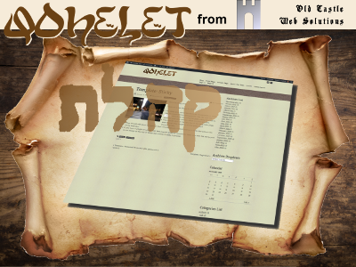

# Qohelet
Qohelet is a fully responsive theme for Wordpress. It has been built on the shoulders of giants, utilizing a number of other technologies, such as: 1. The Quark starter theme by Anthony Horton. 2. Quark is in turn built upon Underscores by Automattix. 3. Quark utilizes Normalize, Modernizr and Options Framework. 4. The Qohelet theme also includes code from the Kirki plugin, to enable this and child themes to use the Customizer more easily. 5. Many other smaller amounts of other technologies have been incorporated, so that I did not re-invent the wheel.

Qohelet is a functional theme. It is not a pretty theme. It is not meant to be a pretty theme. But everything in the background works really well. The idea is that Qohelet can be used to make new themes, or, alternatively, child themes can be built on top of it.

## Version 1.4.5
There had to be some more adjustment to the code, to make sure that brand icons delivered class fab, while unbranded generic icons delivered class fas.

## Version 1.4.4
Qohelet now contains fontawesome version 5 within the theme. This is the most versatile option, and allows for future upgrades.

## Version 1.4.3
TripAdvisor added to social menu. I had to serve fontawesome 5 remotely to achieve this, so examine lines 398 and 889 in functions.php. I have not yet succeeded into downloading fontawesome 5.6 to integrate it properly.

## Version 1.4.2
Minor adjustment to make child theme work better.

## Version 1.4.1
A few extra tweaks added to get Kirki working properly.

## Version 1.4
This version contains support for Kirki, to enable smoother use of the theme and the child themes.

## Version 1.3.1
Minor adjustments made to the footer credits code

## Version 1.3
Support for MeWe added

## Version 1.2.1
Corrected a minor issue in the footer.

## Version 1.2
A slider is added to the banner container. The slider only works if the OCWS Slider plugin is installed and activated.

## Version 1.1
Some minor edits have been made, so that the footer can display the Wordpress version number, along with the current theme, and its version number.

## Version 1.0
The Theme Options page has been more carefully built.

## Version 0.4
A system has been added to enable the export and import of theme options. This will save a lot of work!

The system has been based on "Gantry Export and Import Options" by Hassan Derakhshandeh, and was put together in this form by Jeff Starr of [Digging into Wordpress](https://digwp.com/2014/04/backup-restore-theme-options/). However, the system as it stood would not work for child themes, so I edited it to get this to happen.

## Version 0.3
An earlier attempt to use the Redux Framework has proved too problematic for the moment, sso I have removed it and returned to the Options Framework. I still think the Redux Framework is a better one to use for this theme, but that will have to wait for a later version, as I would like to get this version out and ready.

A number of CSS changes have been made, in order to produce what, for me, is a more pleasing color scheme.

Quite a few changes were made to the blockquote CSS, and the Google fonts were substituted for ones that I prefer.

### Further Development
I like the way that the Simone theme keeps the main content in a central section, except for small screens, where the center section becomes 100% width. I would like to incorporate something similar. In addition, I would like the post meta data to be out at the left hand side, rather than as a header, as it is at the moment.

## Version 0.2
The Redux Framework has been added, and some adjustments made. However, the Options Framework has not yet been removed, as it is deeply embedded, and requires some special (of_get_option) functions to be removed or edited.

